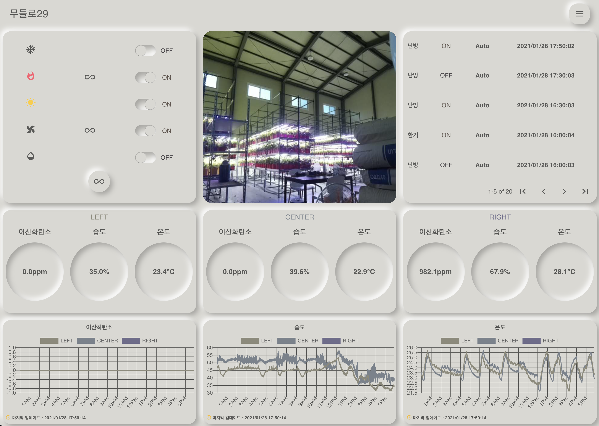
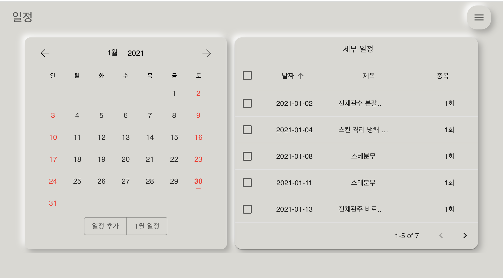

# Notice
This project will be divided into frontend with Typescript and Refactoring and backend with Typescript and Nestjs.

# PlantPoint Web

This is a smartfarm remote system for effective farming. This system make you communicate with device wherever you are. Plus, if you set the conditions, the system controls the power of device automatically  and environments could be regulated. You can take the mobile messages through Telegram whenever the device power changes.

## Demo

This is [Web](http://kbj2060.asuscomm.com:11000/%EB%AC%B4%EB%93%A4%EB%A1%9C29) and [Video](https://www.youtube.com/watch?v=Ues5e7m1w10&lc=UgyAODgET9TnCkozM9J4AaABAg).  For short explanation, Infinite Icon on switch controller component is for **setting automations**. Plus, The environments history which is on the bottom of the page could show you the data for **today**. CCTV component is a photo in this demo. Please, revise src in this image tag from the CCTV/index.js file.

## Environments


- FrontEnd : React, Redux
- BackEnd : Nodejs
- DB : Mysql
- Network : MQTT
- Automation : Python
- Telegram
- pm2

## Configure

**STEP 1. Install the client side and server side packages**

```bash
$ npm i
$ cd client && npm i
```

**STEP 2. Revise setting file**

```json
{
  "IP" : "121.1.xxx.xxx",
  "SOCKET_HOST" : "121.1.xxx.xxx",
  "MQTT_BROKER" : "121.2,xxx.xxx",
  "SOCKET_PORT" : "9000",
  "MQTT_PORT" : "1883",
  "CLIENT_ID" : "Auto",
  "LED_TOPIC" : "switch/led",
  "HEATER_TOPIC" : "switch/heater",
  "COOLER_TOPIC" : "switch/cooler",
  "FAN_TOPIC" : "switch/fan",
  "WT_TOPIC" : "switch/waterpump",
  "pages" : [
    "무들로29", "scheduler", "setting","logout"
  ],
  "machines": {
    "s1" : ["cooler", "heater", "led", "fan", "waterpump"]
  },
  "environments": [
    "co2", "humidity", "temperature"
  ],
  "sections": [
    "s1-1", "s1-2", "s1-3"
  ],
  "autoItem":{
    "s1" : ["led", "heater","cooler", "fan", "waterpump"]
  }
  ,
  "settingType": {
    "s1": {
      "fan": "cycle",
      "waterpump": "cycle",
      "cooler": "range",
      "heater": "range",
      "led": "range"
    }
  }
}

```

* IP : external web ip address
* SOCKET_HOST : socket communication ip address
* SOKET_PORT : socket communication port
* MQTT_BROKER : MQTT Broker ip address
* CLIENT_ID : Automation logging id
* TOPICS :mqtt topic names
* pages : pages name
* machines : machines with section
* environments : sensor data with environments
* sections : section names
* autoItems : automation devices
* settingType : automation type division (cycle : time cycle, range : environments range)

**STEP 3. Should add DB configure file**

``` bash
$ cd values && touch db_conf.json
{
  "host" : "localhost",
  "user" : "root",
  "password" : "PASSWORD_FOR_DB",
  "port" : "3306",
  "database" : "iot"
}
```

**STEP 4. If you want telegram alarm, should change telegram setting file.**

```bash
$ cd values && vi telegram_conf.json
{
  "token" : "TOKEN_FROM_TELEGRAM_BOT",
  "chat_id" : ID_FROM_TELEGRAM_BOT_CHATTING
}
```

## Usage

<p align="center">
  
</p>

<br/>

* Power Automation
* Remote Control
* Environments and Power Logging
* CCTV
* Telegram Alarm

<br/>

<p align="center">
  
</p>

<br/>

* Add Schedule 
* Change Schedule
* Find Schedule
* Remove Schedule


## TO DO LIST

🙋 Change to Typescript

🙋 Next.js

🙋 RxJs

🙋 Easy adding machine
