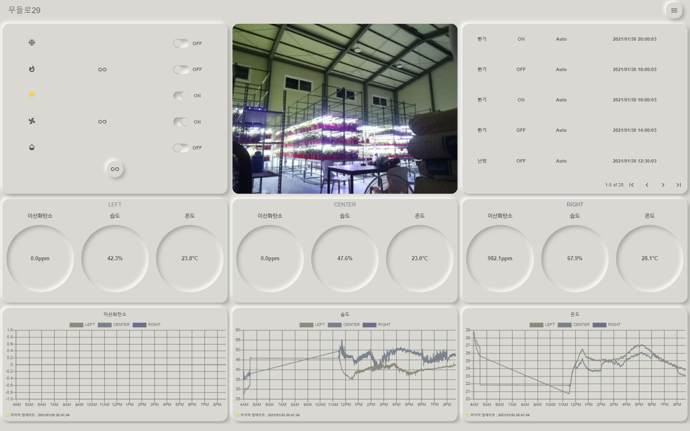

# PlantPoint Web

스마트팜 원격 시스템으로서 농부의 윤택한 생활 을 위해 만들었습니다.
원하는 기기를 서버와 통신하게 하여 원격으로 수동 조종이 가능하고 자동화를 통해 자동 조종이 가능합니다.
텔레그램 알림을 통해 모바일에서도 알림을 받을 수 있습니다.


## Environments


- FrontEnd : React, Redux
- BackEnd : Nodejs
- DB : Mysql
- Network : MQTT
- Automation : Python
- Telegram

## Configure

**STEP 1. 프론트엔드 패키지와 백엔드 패키지를 npm을 통해 설치합니다.**

```bash
$ npm i
$ cd client && npm i
```

**STEP 2. 설정 파일들을 수정합니다.**

```json
{
  "IP" : "121.1.xxx.xxx",
  "SOCKET_HOST" : "121.1.xxx.xxx",
  "MQTT_BROKER" : "121.2,xxx.xxx",
  "SOCKET_PORT" : "9000",
  "MQTT_PORT" : "1883",
  "CLIENT_ID" : "Auto",
  "LED_TOPIC" : "switch/led",
  "HEATER_TOPIC" : "switch/heater",
  "COOLER_TOPIC" : "switch/cooler",
  "FAN_TOPIC" : "switch/fan",
  "WT_TOPIC" : "switch/waterpump",
  "pages" : [
    "무들로29", "scheduler", "setting","logout"
  ],
  "machines": {
    "s1" : ["cooler", "heater", "led", "fan", "waterpump"]
  },
  "environments": [
    "co2", "humidity", "temperature"
  ],
  "sections": [
    "s1-1", "s1-2", "s1-3"
  ],
  "autoItem":{
    "s1" : ["led", "heater","cooler", "fan", "waterpump"]
  }
  ,
  "settingType": {
    "s1": {
      "fan": "cycle",
      "waterpump": "cycle",
      "cooler": "range",
      "heater": "range",
      "led": "range"
    }
  }
}

```

* IP : 웹의 외부 접속 주소
* SOCKET_HOST : 소켓 통신 주소
* SOKET_PORT : 소켓 통신 포트
* MQTT_BROKER : MQTT Broker 주소
* CLIENT_ID : 자동화 로그 주체
* TOPICS : mqtt 통신의 토픽 주제
* pages : 여러 웹페이지 이름
* machines : 섹션 별 기계
* environments : 환경 변수
* sections : 여러 섹션 구분
* autoItems : 섹션별 자동화 기계
* settingType : 섹션별 자동화 구분 (cycle : 시간 사이클, range : 환경 범위에 따른 자동화)

**STEP 3. 데이터베이스 설정 파일 추가**

``` bash
$ cd values && touch db_conf.json
{
  "host" : "localhost",
  "user" : "root",
  "password" : "1234",
  "port" : "3306",
  "database" : "iot"
}
```

## Usage

<p align="center">
  
</p>

위 대시보드에는 아래의 기능들이 존재합니다.

* 전원 자동화
* 전원 원격 조종
* 전원 기록 및 환경 기록
* CCTV
* 텔레그램 알림

<p align="center">
  
</p>

위의 일정에는 아래의 기능들이 존재합니다.

* 일정 추가 / 삭제 / 조회 / 수정


## TO DO LIST

🙋 타입스크립트로 전환

🙋 Next.js 프레임워크로 전환

🙋 RxJs 로 비동기 전환

🙋 쉬운 기기 추가
